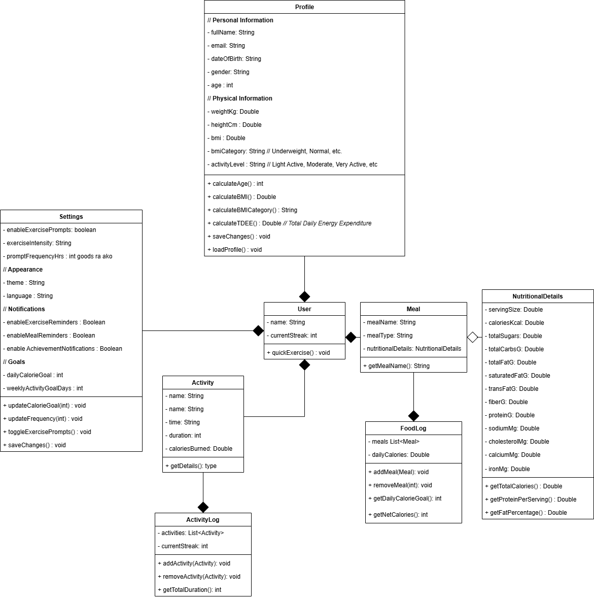

# BiteCheck

## Group Members
- Mc Cauley B. Bacalla
- Dexter James D. Benitez
- Charlone Gianne V. Cruz
- Ycany Ashra T. Sanchez
- Vince Mathew L. Silva

## Project Description
BiteCheck is a dietary tracking application designed to help users monitor, understand, and improve their daily eating habits. Poor dietary habits remain one 
of the leading contributors to preventable diseases worldwide, including cardiovascular conditions, obesity, and diabetes. The growing consumption of unhealthy 
and ultra-processed foods has made it increasingly difficult for individuals to maintain a balanced and nutritious diet, and many people lack the awareness and 
proper tools to evaluate whether their daily eating habits are truly benefiting, harming, or simply providing no value to their overall health. BiteCheck addresses 
this gap by tracking a user's food intake over time, analyzing their nutritional consumption patterns, and delivering personalized feedback — whether that be 
health warnings, encouragement, or actionable dietary suggestions.

## Proposed Features

## Use-Case Diagram
