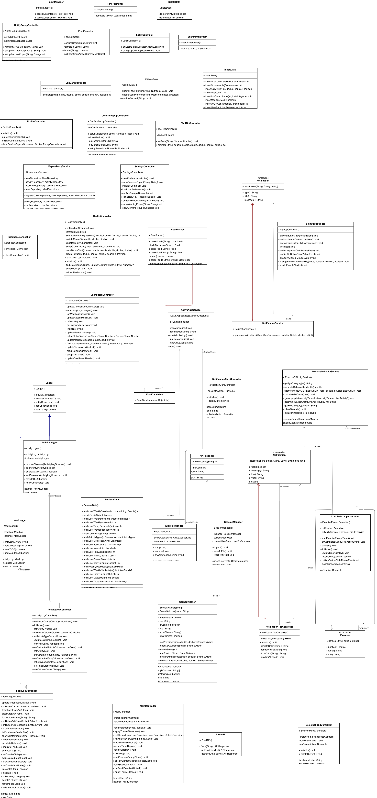
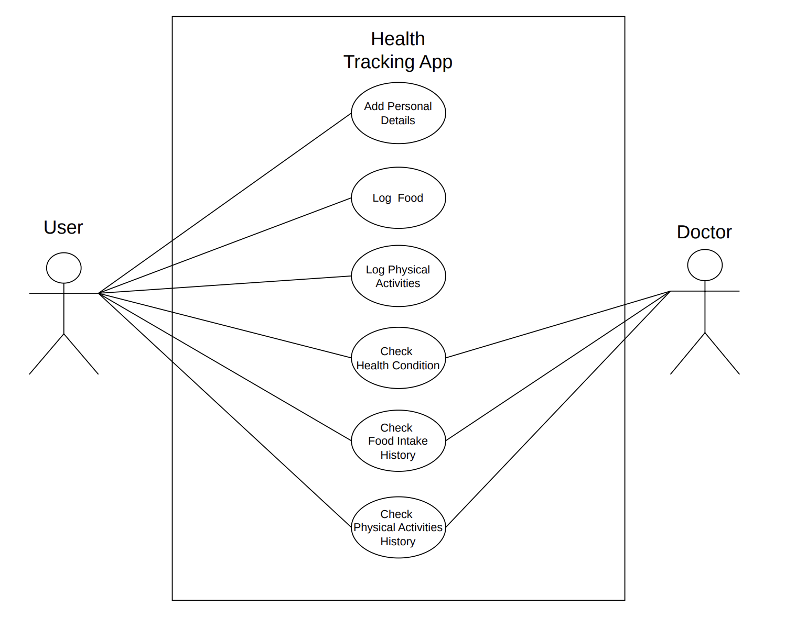

# +inHealth

## About Us
This project was done in compliance with the requirements of CSIT228 - Objet Oriented Programming 2, but also done with the passion of the developers. As such, <mark>**Vibecoding was strictly prohibited**</mark> in the making of this project. [Here](
https://docs.google.com/document/d/1fqUmNk6RI_klp43MLD7dBzI8g5GCK382ezChQ8j83qg/edit?usp=sharing) is a google documents link for some of the sources used in this project, that were shared among the group.

**Members**
- Mc Cauley B. Bacalla -  Backend, Database Operations, UI Behavior, Class Diagrams
- Dexter James D. Benitez - Backend, Database Operations, Some Frontend
- Charlone Gianne V. Cruz - Architecture and Patterns, Frontend, Business Logic, Some Backend
- Ycany Ashra T. Sanchez - API business logic, Backend, Business Logic, Database Operations
- Vince Mathew L. Silva - Backend, Frontend, Database Operations, Class Diagrams

## Project Description
+inHealth is a comprehensive health tracking application designed to help users monitor, understand, and improve their overall well-being by tracking 
both their daily meal consumption and physical activities. Unlike other health tracking apps, +inHealth actively interrupts sedentary behavior by forcing a physical activity prompt whenever any application is opened on the computer within a set amount of time. This ensures that users sitting for long hours of school, work, or leisure in their desktops are consistently reminded to move. Sedentary lifestyles and poor dietary habits remain among the leading contributors 
to preventable diseases worldwide, including cardiovascular conditions, obesity, and diabetes. The growing consumption of unhealthy and 
ultra-processed foods, combined with increasingly inactive daily routines, has made it more difficult for individuals to maintain a balanced and 
healthy lifestyle. Many people lack the awareness and proper tools to evaluate whether their daily habits — both in eating and physical activity — are truly 
benefiting, harming, or simply providing no value to their overall health. +inHealth addresses this gap by analyzing a user's nutritional intake and activity
patterns over time, then delivering personalized feedback — whether that be health warnings, encouragement, or actionable suggestions — to guide users 
toward healthier and more informed lifestyle choices.

## Implemented Features
- **Dashboard & Progress Tracking:** Visual representation of health data, meal intakes, and activities.
- **Meal and Activity Logging:** Logging of daily food consumption and physical exercises.
- **Adaptive Activity Interruptions:** Forces physical activity prompts during prolonged computer usage.
- **Nutritional API Integration:** Real-time fetching of food nutrition data.
- **Notification System:** Alerts and prompts for health goals and exercise interruptions.
- **User Profiles & Preferences:** Customizable user settings, health data, and goal management.

  
## Design Patterns and Architecture

### Architectural Patterns
- **Model-View-Controller (MVC):** Separation of application logic (`DashboardController`, `FoodLogController`), user interface (`dashboard-view.fxml`, `food-log-view.fxml`), and data models (`Meal`, `Activity`, `User`).
- **Repository Pattern:** Abstracts database operations for specific entities (e.g., `UserRepository`, `MealRepository`, `ActivityRepository`).
- **Data Access Object (DAO) Pattern:** Required to properly follow the dependency inversion principle. Uses abstracted DataSources (e.g., `IUserDataSource`, `IMealDataSource`, `MealDataSource`) to communicate with Database Operations.
- - **Dependency Injection Pattern:** Was used in conjunction with the DAO pattern in order to folllow the dependency inversion principle. This was done via `DependencyService` that injects the dependencies on the controllers.

### Creational Patterns
- **Singleton Pattern:** Manages unique application-wide instances such as the database connection (`DatabaseConnection`) and active session state (`SessionManager`).
- **Builder Pattern:** The `SceneSwitcher` uses a builder pattern to adapt to the many ways in which the program switches views.

### Structural Patterns
- **Adapter Pattern:** Adapts external nutritional API responses to internal application models (`FoodParser` & `FoodSelector`).

### Behavioral Patterns
- **Observer Pattern:** Implemented for activity and food logging to trigger updates on data changes, as well as to trigger exercise prompts by observing the current active app running (`ActivityLogObserver`, `MealLogObserver`, `ExerciseObserver`).
- **State Pattern:** Manages execution states including loading, error, success, and idle states (`State`, `LoadingState`, `ErrorState`, `SuccessState`, `IdleState`).
- **Template Pattern:** Implemented in the abstract `Logger<T>` class. It defines the exact skeleton of the data logging workflow inside the final `logData()` method, enforcing a sequence of conditional validation (`isValid()`), persistence (`saveToDB()`), and event signaling (`notifyObservers()`), while deferring the execution specifics to concrete subclasses (`MealLogger`, `ActivityLogger`).

## SOLID Principles
- **Single Responsibility Principle (SRP):** Enforced through MVC architecture and data layer separation. Each class manages a single concern (e.g., UI controllers like `ProfileController` handle only views, while DAOs like `ActivityDataSource` handle only specific database queries).
- **Open/Closed Principle (OCP):** The Observer and State patterns allow the application to introduce new observers (implementing `ExerciseObserver`) or application states (extending `State`) without modifying existing core classes.
- **Liskov Substitution Principle (LSP):** Implemented through data source interfaces. Any new implementation of interfaces like `IMealDataSource` or `IActivityDataSource` can replace existing ones without breaking the repository logic in `MealRepository` or `ActivityRepository`.
- **Interface Segregation Principle (ISP):** Data access interfaces are strictly separated by entity (e.g., `IMealDataSource`, `IActivityDataSource`, `IUserPrefDataSource`), ensuring classes do not depend on methods they do not use.
- **Dependency Inversion Principle (DIP):** Repositories (`UserRepository`, `ActivityRepository`) depend on abstracted data source interfaces (`IUserDataSource`, `IActivityDataSource`) rather than concrete database classes, decoupling high-level application logic from low-level SQL executions.

## Generics
- **SceneSwitcher Custom Utility:** The `SceneSwitcher` uses a generic method `<T> T switchScene()` to automatically infer and return the specific JavaFX controller type. This allows the application to cleanly instantiate controllers without requiring explicit and unsafe type casting.
- **Logger Base Class:** The abstract `Logger<T>` class utilizes generics to manage lists of specific observer types. This ensures type-safe observer registration and notification processes when inherited by specific loggers like `MealLogger` or `ActivityLogger`.

## Class Diagram

## Use Case Diagram

